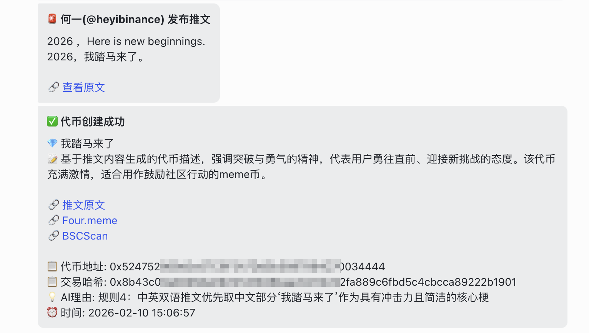

<p align="center">
  
</p>

<h1 align="center">FourMeme Tools</h1>

<p align="center">
  <b>AI 驱动的 BSC 链 Meme 代币自动发射工具</b>
</p>

<p align="center">
  <a href="#功能特性">功能特性</a> •
  <a href="#系统架构">系统架构</a> •
  <a href="#快速开始">快速开始</a> •
  <a href="#使用方式">使用方式</a> •
  <a href="#配置说明">配置说明</a>
</p>

---

## 项目简介

FourMeme Tools 是一款自动化 Meme 代币创建工具，通过 Telegram 实时监听 CZ（赵长鹏）和何一的推特动态（via [Debot.ai](https://debot.ai)），利用 AI 分析推文的 Meme 潜力，并自动在 [Four.meme](https://four.meme)（BSC 链）上创建代币。

**从 CZ 发推到代币创建完成，全程不超过 30 秒。**

<p align="center">
  
</p>

## 功能特性

- **实时推文监听** — 通过 Telegram 群组（via [Debot.ai](https://debot.ai)）监听 CZ / 何一的推特通知
- **AI Meme 分析** — 使用 GPT-5.1 / Gemini / Claude 判断推文是否具有 Meme 潜力，配合严格过滤规则
- **自动创建代币** — 通过智能合约交互，在 Four.meme 上自动创建 Meme 代币
- **捆绑买入** — 支持代币创建后多钱包并发买入
- **飞书通知** — 通过飞书 Webhook 实时推送推文监控和代币创建结果
- **回复推文分析** — 获取并分析被回复的原始推文，提供完整上下文
- **编辑检测** — 检测推文编辑行为，优先将变更内容作为潜在 Meme 关键词
- **中国节日识别** — 识别 CZ 的中国节日祝福（如"马年快乐"）作为高价值 Meme
- **CZ 新书监控** — 监控 CZ 即将公布的新书书名，作为最高优先级 Meme 事件

## 系统架构

```
┌─────────────┐    ┌──────────────┐    ┌───────────────┐    ┌──────────────┐
│  Twitter/X   │───▶│  Debot.ai    │───▶│   Telegram    │───▶│ FourMeme     │
│  (CZ / 何一) │    │  (监控转发)   │    │   (群组)      │    │ Tools        │
└─────────────┘    └──────────────┘    └───────────────┘    └──────┬───────┘
                                                                    │
                                                    ┌───────────────┼───────────────┐
                                                    ▼               ▼               ▼
                                              ┌──────────┐  ┌────────────┐  ┌────────────┐
                                              │ AI 模型   │  │ Four.meme  │  │   飞书     │
                                              │ 分析判断   │  │ 代币创建    │  │   通知     │
                                              │ (GPT/     │  │ (BSC链)    │  │            │
                                              │  Gemini)  │  │            │  │            │
                                              └──────────┘  └────────────┘  └────────────┘
```

## 快速开始

### 环境要求

- Python 3.9+
- MySQL 5.7+（用于代币记录存储）
- Telegram 账号及 API 凭证
- BSC 钱包及 BNB（用于创建代币）

### 安装

```bash
# 克隆仓库
git clone https://github.com/liangfuwang/fourmeme_tools.git
cd fourmeme_tools

# 创建虚拟环境
python3 -m venv venv
source venv/bin/activate  # Linux/macOS
# venv\Scripts\activate   # Windows

# 安装依赖
pip install -r requirements.txt

# 配置环境变量
cp .env.example .env
# 编辑 .env 填入实际配置值
```

### 安装中文字体（用于 Meme 图片生成）

```bash
# Ubuntu/Debian
sudo apt-get install -y fonts-wqy-zenhei fonts-wqy-microhei fonts-noto-cjk

# CentOS/RHEL
sudo yum install -y wqy-zenhei-fonts google-noto-sans-cjk-fonts
```

## 使用方式

### 1. 监听模式（主模式）

启动实时监听 — 监听 Telegram 群组、AI 分析推文、自动创建代币：

```bash
python fourmeme_tools.py
```

### 2. 通过 URL 分析推文

获取指定推文，运行 AI 分析并创建代币：

```bash
python fourmeme_tools.py --tweet "https://x.com/cz_binance/status/1234567890"
```

### 3. 通过文本分析推文

分析原始推文文本（支持 Debot.ai 格式）：

```bash
python fourmeme_tools.py --tweet "马年快乐！"
```

### 4. 手动创建代币

使用自定义参数创建代币：

```bash
# 交互模式
python fourmeme_tools.py --create

# 命令行模式
python fourmeme_tools.py --create --name "YOLO" --ticker "YOLO" --desc "YOLO meme token on BSC"
```

### 5. 查看钱包信息

验证钱包配置和余额：

```bash
python fourmeme_tools.py --wallet
```

## 配置说明

所有配置通过 `.env` 文件管理，参见 [`.env.example`](.env.example) 了解全部可用选项。

### 核心配置项

| 变量名 | 说明 | 是否必填 |
|--------|------|----------|
| `TG_API_ID` | Telegram API ID | 是 |
| `TG_API_HASH` | Telegram API Hash | 是 |
| `TG_PHONE_NUMBER` | Telegram 手机号 | 是 |
| `TWITTER_MONITOR_GROUP_ID` | 推文监听 Telegram 群组 ID | 是 |
| `AI_API_KEY` | AI API 密钥（OpenAI 兼容） | 是 |
| `AI_MODEL` | AI 模型名称（默认: GPT-5.1） | 否 |
| `ENABLE_AI_ANALYSIS` | 是否启用 AI 分析 | 否 |
| `WALLET_PRIVATE_KEY` | BSC 钱包私钥 | 自动发币时需要 |
| `WALLET_ADDRESS` | BSC 钱包地址 | 自动发币时需要 |
| `ENABLE_AUTO_CREATE` | 是否启用自动创建代币 | 否 |
| `FEISHU_WEBHOOK_URL` | 飞书 Webhook 通知地址 | 否 |
| `MYSQL_PASSWORD` | MySQL 数据库密码 | 是 |

### AI 模型回退链

工具采用级联回退策略进行 AI 分析：

```
GPT-5.1 → GPT-5-Chat → Gemini-2.5-Pro → Claude-HaiKu-4.5 → Gemini-2.5-Flash → GPT-4o
```

## 运行截图

<details>
<summary>推文告警通知（飞书）</summary>

```
📢 推文告警 - CZ(@cz_binance)
👤 CZ(@cz_binance) 发布推文

📄 马年快乐！

🔗 推文原文
💡 推文只是简单的祝福语...
⏰ 2026-02-16 22:16:30
```

</details>

<details>
<summary>AI 分析结果</summary>

```
🔍 AI 分析结果 - 马年快乐
👤 CZ(@cz_binance) 发布推文

💎 Meme: 马年快乐
📝 CZ celebrates Year of the Horse with Chinese greeting
💡 AI理由: 中文生肖祝福 = 金狗meme！
⏰ 2026-02-16 22:16:31
```

</details>

<details>
<summary>代币创建成功</summary>

```
✅ 代币创建成功
💎 马年快乐
📝 CZ celebrates Year of the Horse...

🔗 推文原文
🔗 GMGN

📋 代币地址: 0x...
📋 交易哈希: 0x...
📦 捆绑买入: 9/9 成功
⏰ 2026-02-16 22:16:35
```

</details>

## 技术栈

- **Python 3.9+** — 核心运行时
- **Telethon** — Telegram 客户端库
- **OpenAI SDK** — AI 分析（兼容 DeepBricks 等中转平台）
- **Web3.py** — BSC 区块链交互
- **Four.meme API** — 代币创建平台
- **Pillow** — Meme 图片生成
- **PyMySQL** — 代币记录存储
- **飞书 Webhook** — 实时通知推送

## 安全说明

- 所有敏感凭证存储在 `.env` 文件中（已排除在 git 之外）
- 钱包私钥不会被记录到日志或对外暴露
- 自动创建代币需要显式开启 `ENABLE_AUTO_CREATE=true`
- 捆绑买入需要显式开启 `ENABLE_BUNDLE_BUY=true`

## 开源协议

MIT License

## 免责声明

本工具仅供学习和研究使用。加密货币交易和代币创建涉及重大财务风险，使用者需自行承担风险。作者不对因使用本工具而造成的任何经济损失承担责任。
